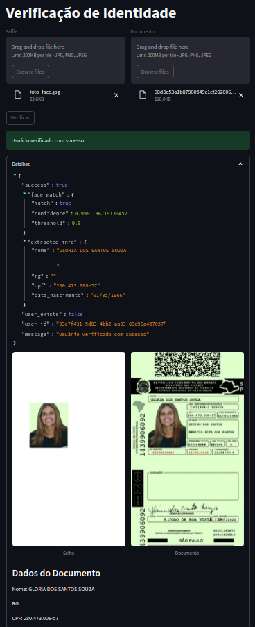

# Reconhecimento Facial

Este projeto realiza verificação de identidade utilizando reconhecimento facial e OCR (Reconhecimento Óptico de Caracteres). Ele combina tecnologias como FastAPI, Streamlit, Supabase, DeepFace e Tesseract OCR para criar uma solução robusta de validação de identidade.

---

## **Como Executar o Projeto**

### **1. Instalar Dependências**
Certifique-se de que você tem o Python instalado (versão 3.8 ou superior). Em seguida, instale as dependências do projeto:
```bash
pip install -r requirements.txt
```

### **2. Configurar Variáveis de Ambiente**
Crie um arquivo `.env` na raiz do projeto com as seguintes variáveis de ambiente:
```env
SUPABASE_URL=https://<sua-instância>.supabase.co
SUPABASE_KEY=<sua-chave-api>
API_URL=http://localhost:8321/verify
```

### **3. Executar o Servidor FastAPI**
Inicie o servidor FastAPI:
```bash
uvicorn api:app --reload --host 0.0.0.0 --port 8321
```

### **4. Executar a Interface Streamlit**
Em outro terminal, execute o Streamlit:
```bash
streamlit run app.py
```

### **5. Acessar a Interface**
Abra o navegador e acesse [http://localhost:8501](http://localhost:8501). Faça upload das imagens (selfie e documento) para testar a funcionalidade.

---

## **Tecnologias Utilizadas**
- **FastAPI**: Framework para criação de APIs rápidas e eficientes.
- **Streamlit**: Framework para criação de interfaces web interativas.
- **Supabase**: Banco de dados e autenticação.
- **DeepFace**: Biblioteca para reconhecimento facial.
- **Tesseract OCR**: Ferramenta para reconhecimento óptico de caracteres.

---

## **Erros Comuns e Soluções**

### **Erro 1: Tesseract não encontrado**
**Mensagem de erro:**
```plaintext
Error opening data file /usr/share/tesseract-ocr/5/tessdata/por.traineddata Please make sure the TESSDATA_PREFIX environment variable is set to your "tessdata" directory.
```

**Solução:**
1. Instale o Tesseract:
   ```bash
   sudo apt install tesseract-ocr
   ```
2. Instale o idioma `por`:
   ```bash
   sudo apt install tesseract-ocr-por
   ```
3. Configure a variável de ambiente `TESSDATA_PREFIX`:
   ```bash
   export TESSDATA_PREFIX=/usr/share/tesseract-ocr/5/
   ```

---

### **Erro 2: Tesseract não está no PATH**
**Mensagem de erro:**
```plaintext
tesseract is not installed or it's not in your PATH.
```

**Solução:**
1. Verifique se o Tesseract está instalado:
   ```bash
   tesseract --version
   ```
2. Adicione o Tesseract ao PATH:
   ```bash
   export PATH=$PATH:/usr/bin
   ```

---

### **Erro 3: Supabase retornando 404**
**Mensagem de erro:**
```plaintext
HTTP Request: POST http://0.0.0.0:8000//rest/v1/usuarios "HTTP/1.1 404 Not Found"
```

**Solução:**
1. Verifique a variável de ambiente `SUPABASE_URL` e certifique-se de que ela aponta para a URL correta do Supabase.
2. Confirme que a tabela `usuarios` existe no Supabase.

---

### **Erro 4: UUID incompatível com o tipo de dado**
**Mensagem de erro:**
```plaintext
invalid input syntax for type bigint: "6af8beb5-ae33-49c1-ad3c-20b147939875"
```

**Solução:**
1. Altere o tipo do campo `id` para `uuid` no Supabase:
   ```sql
   ALTER TABLE usuarios ALTER COLUMN id TYPE uuid USING id::uuid;
   ```
2. Ou, no código, converta o UUID para um inteiro:
   ```python
   user_id = int(uuid.uuid4().int >> 64)
   ```

---

### **Erro 5: Política de segurança em nível de linha (RLS)**
**Mensagem de erro:**
```plaintext
new row violates row-level security policy for table "usuarios"
```

**Solução:**
1. Crie uma política para permitir inserções:
   - Acesse o painel do Supabase.
   - Vá para a aba **Policies** da tabela `usuarios`.
   - Crie uma política com as expressões `true` para `INSERT`.
2. Ou desative o RLS:
   - No painel do Supabase, clique em **Disable RLS**.

---

### **Erro 6: HTTP 500 Internal Server Error**
**Mensagem de erro:**
```plaintext
HTTP/1.1 500 Internal Server Error
```

**Solução:**
1. Verifique se todas as variáveis de ambiente estão configuradas corretamente.
2. Leia os logs do servidor para identificar a causa exata do erro.

---
## **Demo**

## **Contribuição**
Sinta-se à vontade para contribuir com este projeto. Faça um fork, crie uma branch e envie um pull request com suas melhorias.

---

## **Licença**
Este projeto está licenciado sob a licença MIT. Consulte o arquivo `LICENSE` para mais detalhes.

---

## Melhorias Futuras

Aqui estão algumas sugestões de melhorias que podem ser implementadas neste projeto:

1. **Adicionar Testes Automatizados**: Implementar testes unitários e de integração para garantir a qualidade do código e evitar regressões.
2. **Melhorar a Interface do Usuário**: Tornar a interface do Streamlit mais amigável e intuitiva, com mensagens de erro claras e feedback visual.
3. **Adicionar Suporte a Outros Idiomas**: Expandir o suporte para reconhecimento de texto em outros idiomas além do português.
4. **Implementar Logs Detalhados**: Adicionar logs detalhados para facilitar a depuração e o monitoramento do sistema.
5. **Adicionar Autenticação**: Proteger a API com autenticação, como tokens JWT, para evitar acessos não autorizados.
6. **Melhorar a Documentação**: Expandir a documentação com exemplos de uso, arquitetura do sistema e instruções detalhadas de configuração.
7. **Adicionar Suporte a Banco de Dados Local**: Permitir o uso de um banco de dados local (como SQLite) para desenvolvimento e testes.
8. **Implementar Cache**: Adicionar um sistema de cache para melhorar o desempenho em operações repetitivas, como reconhecimento facial ou OCR.
